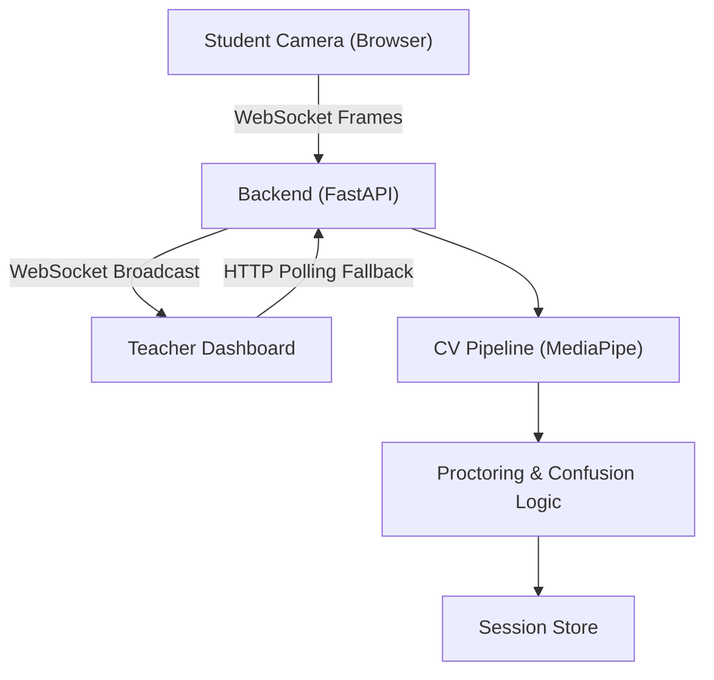

# SmartSession – Real-Time Student Engagement & Proctoring System

SmartSession is a real-time classroom monitoring system designed to help teachers understand **student engagement** and **proctoring integrity** during online sessions.

The system focuses on **explainable logic**, **modular architecture**, and **graceful real-time processing**, rather than black-box AI models.

> 📘 **[Technical Report](docs/TECHNICAL_REPORT.md)**: Detailed engineering documentation covering Architecture, Confusion Logic, and Code Integrity.

---

## 🎯 Problem Statement

In online learning environments, instructors lack visibility into:
- Student focus and confusion
- Proctoring violations (no face, multiple faces)
- Sustained disengagement over time

SmartSession addresses this by analyzing live camera frames and presenting **clear, interpretable session states** to the teacher.

---

## 🧠 Design Philosophy

- **Explainable over opaque AI**
- **Rule-based logic** before ML complexity
- **Incremental development**
- **Fail-safe backend processing**
- **Teacher-first UI (glanceable, not noisy)**

---

## 🏗️ System Architecture
1. **Hybrid Communication**: Uses **WebSockets** for real-time, low-latency updates (status, feedback) and **HTTP** for robust initial state fetching and fallbacks.
2. **Global Session Store**: Singleton in-memory store in Python ensures state persistence even if the frontend reconnects.



---

## 🔧 Technology Stack
### Frontend
- React / Next.js
- TailwindCSS
- **WebSocket API (Native)**

### Backend
- **FastAPI (Async)**
- **WebSockets** (Connection Manager)
- MediaPipe (Face Mesh) & OpenCV (Fallback)

---

## 📦 Key Implementation Features
1.  **Hybrid Real-Time Engine**: Primary WebSocket channel for sub-100ms updates, with redundant HTTP polling for network resilience.
2.  **Explainable Confusion AI**: Geometric brow-furrow analysis (not black-box), ensuring transparency.
3.  **Proctoring Integrity**: Detects "Looking Away" (Left/Right/Up/Down) using gaze vector algebra.
4.  **Robust Fallback**: If MediaPipe fails, the system auto-downgrades to OpenCV Haar Cascades without crashing.

---

## 🧪 Testing Strategy
- **Confusion**: Deterministic "Frown Test" with thresholds tuned for webcam sensitivity.
- **Latency**: End-to-end frame-to-dashboard latency tracked (<200ms).
- **Edge Cases**: Handles disconnected clients, no-face, and partial face data gracefully.

---

## 🔮 Future Improvements
- Persistent Database (PostgreSQL)
- Authentication (OAuth)
- Multi-Room Support

---

## ▶️ How to Run

### Backend
```bash
uvicorn app.main:app --reload
```

### Frontend
```bash
cd frontend
npm install
npm run dev
```

### Access Points:Example 
- **Teacher Dashboard**: [http://localhost:3000/teacher](http://localhost:3000/teacher)
- **Student Portal**: [http://localhost:3000/student](http://localhost:3000/)

## 🎥 Demo & Walkthrough

A video walkthrough explains:
1. Architecture decisions
2. End-to-end data flow
3. Panic test demonstration
4. Teacher dashboard behavior

## 🧑‍💻 Author

Developed as part of an internship assignment to demonstrate:
- System thinking
- Real-time data processing
- Explainable AI principles
